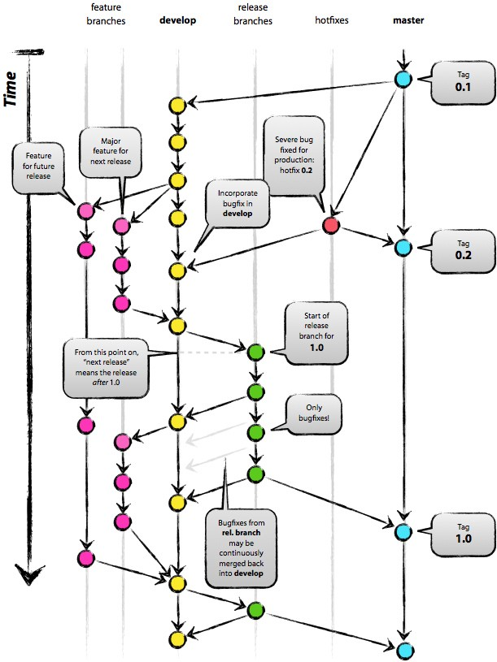

# Git

## Create repo on Github from existing directory

1. Create repo on Github without `README`

2. Init
```
git init
```

2.bis. Define a `.gitignore` to exclude files from versioning, and add it to git
```
file/pattern/to/exclude
```

```
git add .gitignore
```

3. Add all files
```
git add .
```

4. Remove files
```
git rm --cached file
```

## Committing

```
git add file_containing_changes_to_be_committed
git commit file_containing_changes_to_be_committed -m "Commit message for this specific file"
```

To commit every changes
```
git commit -a -m "Commit message"
```

Pushing to Github
```
git push origin master
```

## Explore files

List all tracked files under `master` branch
```
git ls-tree -r master --name-only
```
List all tracked files that ever existed
```
git log --pretty=format: --name-only --diff-filter=A | sort - | sed '/^$/d'
```
Remove big files: BFG Repo Cleaner. To remove big files, passwords, credentials simpler than ` git filter-branch`

## Branches



List all branches
```
git branch -a
OR
git show-branch  // branch and commit 
```

Create local branch
```
git branch my-new-branch
git checkout new-branch  // switch to that branch 
OR
git checkout -b my-new-branch
```

Create branch on a github remote (work on a local branch)
```
git push remote-name branch-name  // typically remote-name is origin, branch-name is the same name for the local and remote branch
```

## Remotes

Add a new remote to git repo
```
git remote add remote-name remote-url
```

List remotes
```
git remote -v
```


## Pull request

1. Fork
2. Commit changes, create new branch
3. Pull request on github's web interface

## Git pull (update local repo from remote)

Equivalent of `git fetch` followed by `git merge` (or `git rebase` if using a rebase strategy).

* `git fetch`: download the content of another branch
* `git merge`: merge the content following a chosen strategy (ex: commit merge, rebase merge)


